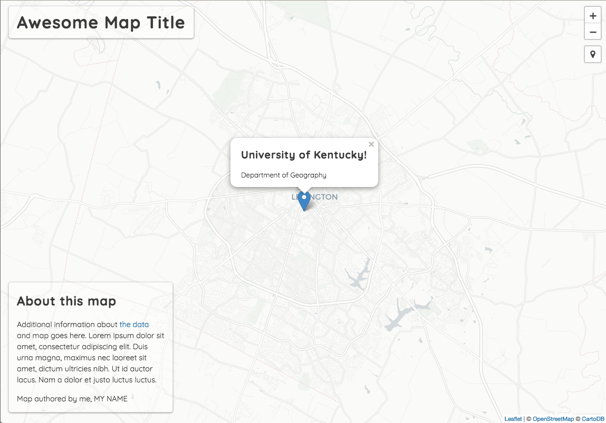
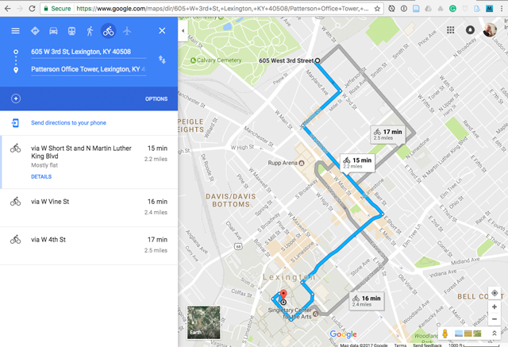
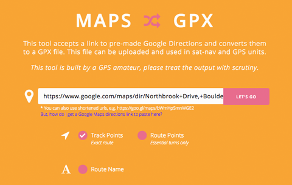
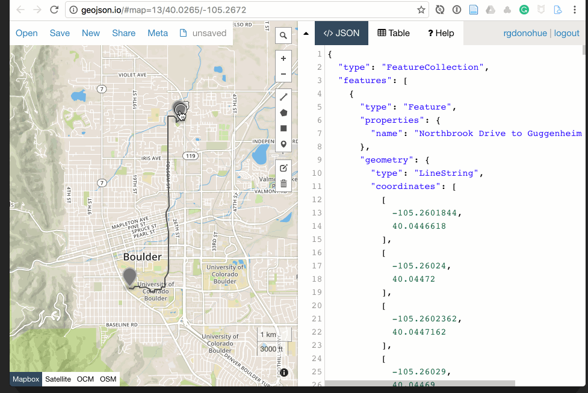
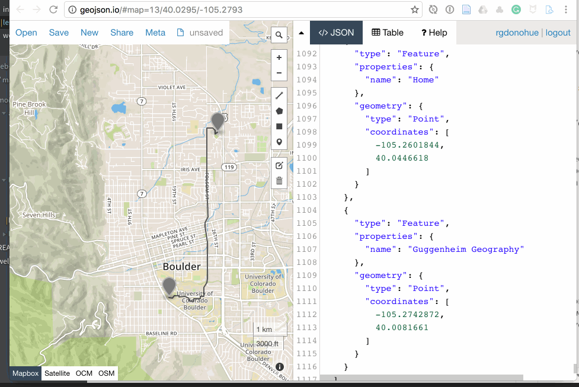
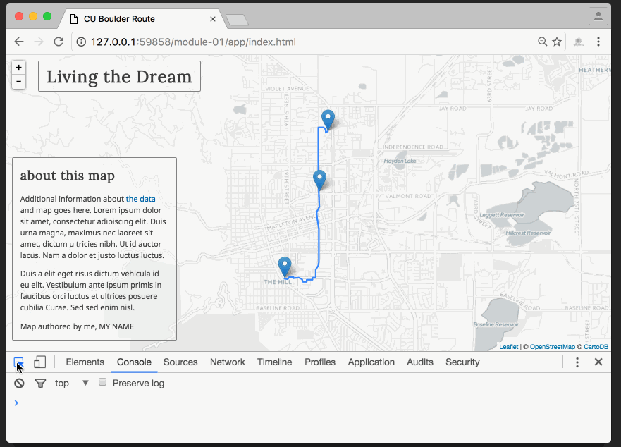
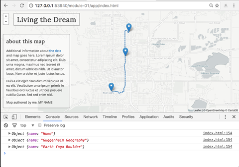
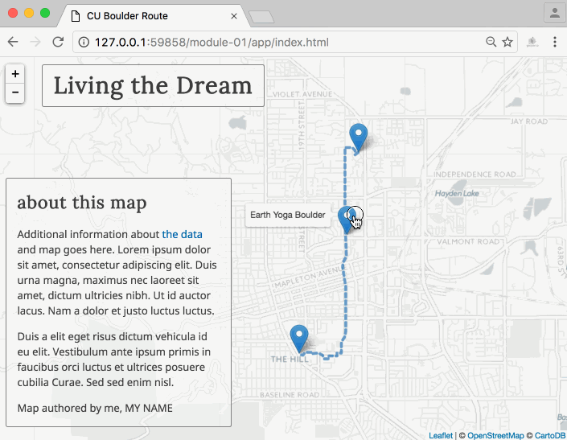

# Lab 06. Drawing Data with Leaflet

This lab walks you through a process of grabbing data from Google Maps, displaying it on your Leaflet web map, and adding interactivity for your user.

## TOC

<!-- TOC -->

- [Lab 06. Drawing Data with Leaflet](#lab-06-drawing-data-with-leaflet)
    - [TOC](#toc)
    - [Part I. Understanding the lesson (1 pts)](#part-i-understanding-the-lesson-1-pts)
    - [Part II. Quiz (3 pts)](#part-ii-quiz-3-pts)
    - [Part III. Tutorial to create Leaflet map with GeoJSON data (6 pts)](#part-iii-tutorial-to-create-leaflet-map-with-geojson-data-6-pts)
        - [Review of the web technology stack](#review-of-the-web-technology-stack)
            - [HTML (structure)](#html-structure)
            - [CSS (form)](#css-form)
            - [JavaScript (behavior)](#javascript-behavior)
        - [Mapping scenario: mapping your route around town](#mapping-scenario-mapping-your-route-around-town)
            - [Step 1: Data acquisition and conversion.](#step-1-data-acquisition-and-conversion)
            - [Step 2: Loading external data into a web document.](#step-2-loading-external-data-into-a-web-document)
            - [Step 3: Drawing GeoJSON data on the map.](#step-3-drawing-geojson-data-on-the-map)
            - [Step 4: Styling the features.](#step-4-styling-the-features)
            - [Step 5: Adding user interaction.](#step-5-adding-user-interaction)
            - [Step 6: Making the map whole: titles, information, and metadata](#step-6-making-the-map-whole-titles-information-and-metadata)
    - [Challenge: Design a full-screen map version (+1)](#challenge-design-a-full-screen-map-version-1)
    - [Finally!](#finally)

<!-- /TOC -->

## Part I. Understanding the lesson (1 pts)

Run through the lesson _README.md_ and use the _lesson-06/index.html_ file to write/execute the statements presented in the lesson. It is critical you practice writing and executing code that creates and manipulates Leaflet maps and events. You can comment out statements that you're already completed. Commit changes as you go and finally push the index.html to your GitHub repo.

## Part II. Quiz (3 pts)

Create a new file named _quiz-06.md_ within your _lab-06/_ directory. Answer the following questions and save them within the quiz-06.md file. 

1. The lesson explains the various meanings of the word 'map' in the statement that instantiates a Leaflet map object, i.e., `var map = L.map('map', options);` We could use just `L.map('map', options);` to create a map, but why do we create a variable (`var map`) for the map object? 

Use the code found in the [quiz.html](quiz.html) file for the following two questions.

2. The page shows a route on a map with the start and end points for a likely trip after work on Friday. Look at the variable `fridaysAfterWork`. What is this data structure called? Use dot and bracket notation and write a JavaScript statement that accesses the value on **line 356**, "Patterson Office Tower, 120 ..."

3. When you click anywhere on the map, a marker is added for that location with a popup (or tooltip depending on browser) that gives the latitude and longitude. We want to place markers **only** on the route or start/end points. Edit the JavaScript beginning at **line 402** to constrain the user's click to just the route and start/end points, i.e., you can only place a marker if you click on the line or the start/end points. Hint: think about why we create variables for Leaflet objects as asked in the first question.


## Part III. Tutorial to create Leaflet map with GeoJSON data (6 pts)

Begin with a simple working template for making our Leaflet web map. Using a localhost server, open the *lab-06/index.html* file within your browser.

If the map loads correctly, you should see a light base map centered on the University of Kentucky. A marker is located at this location with a popup on the marker. There should also be no errors in the Developer Tool Console. 

 
*The Leaflet map template loaded in the browser, with no errors in the Console.*

This document will be your practice to build a tour of your desired location. When you complete the requirements, you can do the lab challenge and apply this methodology to your hometown map.

Before we begin, let's look carefully at our map template document to understand how it's all working.

### Review of the web technology stack

Let's quickly review how our map application runs using three essential web technologies: HTML, CSS, and JavaScript.

#### HTML (structure)

The HTML structures and describes the content of our document. Some of its elements (`<style>` and `<script>` tags) load additional files such as CSS, JavaScript, or image files into the document upon page load.

Study this skeleton HTML template:

```html
<!DOCTYPE html>
<html>

<head>
 <meta charset=utf-8 />
 <title>Leaflet Map Template</title>
 <meta name='viewport' content='initial-scale=1,maximum-scale=1,user-scalable=no' />
 <link rel='icon' href='https://newmapsplus.github.io/favicon.ico' type='image/x-icon' />

 <!-- load additional CSS files here and this is an HTML comment -->

 <style>

 /* CSS rules go here and this is a CSS comment */

 </style>
</head>

<body>

 <h1>Awesome Map Title</h1>

 <!-- more HTML goes here -->

 <!-- load additional JS files here -->
 <script>

 // JavaScript goes here and this is a JS comment

 </script>

</body>

</html>
```

Note that within the HTML document itself, we load the CSS resources at the top, write any HTML elements within the `<body></body>` tags, and load and write any JavaScript at the bottom of the document, directly before the closing `</body>` tag.

Within your *lab-06/index.html* template file, note that we're also reserving some HTML to display additional information about the map.

```html
<section id="about">
 <h2>about this map</h2>
 <p>Additional information about <a href="#">the data</a> and map goes here. Lorem ipsum dolor sit amet, consectetur adipiscing elit. Duis urna magna, maximus nec laoreet sit amet, dictum ultricies nibh. Ut id auctor lacus. Nam a dolor et justo luctus luctus. </p>
 <p>Map authored by me, MY NAME</p>
</section>
```

 Here we're using HTML `<section>` tags to hold the content, accessible through the id attribute of "about". This layout uses CSS properties to show full-screen content that adapts to the browser size. Let's turn our attention to building our page style.

#### CSS (form)

If the HTML structures our content, the primary role of CSS is to give that structure form. We apply CSS rules to the web page and elements we draw to the map to adjust the "look and feel" of the page and map. 

First, add links to external style resources in the `head` element. The `leaflet.css` provides styling for Leaflet user interface elements. The `font-awesome.min.css` and `L.Control.Locate.min.css` are styles for a [Leaflet plugin](https://leafletjs.com/plugins.html) that extend page functionality. In our case, we're adding the ability for a map user to geolocate their position with the [leaflet-locatecontrol](https://github.com/domoritz/leaflet-locatecontrol) plugin. Finally, let's change our font to a unique Google font with a link to the `Quicksand` font family.

```html
<link rel="stylesheet" href="https://unpkg.com/leaflet@1.6.0/dist/leaflet.css" />
<link rel="stylesheet" href="https://maxcdn.bootstrapcdn.com/font-awesome/4.7.0/css/font-awesome.min.css">
<link rel="stylesheet" href="https://cdnjs.cloudflare.com/ajax/libs/leaflet-locatecontrol/0.72.0/L.Control.Locate.css" integrity="sha512-oA/Bm/ylO3xoKtPSYmEAaIqI7OeW3caUl5RSx1sTrNEUQ83gZYrie3V3TnEI4UkYdzkAKjiQ22dJ3wf6K6encg==" crossorigin="anonymous" />

<link href="https://fonts.googleapis.com/css?family=Quicksand:400,700" rel="stylesheet">
```

Next, apply rules that fix our page elements in the browser window. The `position: absolute;` property makes the element remain in the same position on the page, e.g., we've been using Leaflet's zoom control element that's placed in an absolute position. The `background`, `box-shadow`, and `border` properties are styled to mimic Leaflet's user interface elements.

```css
body {
 margin: 0;
 padding: 0;
 font-family: 'Quicksand', sans-serif;
 font-size: 100%;
 color: #3d3d3d;
}

h1 {
 position: absolute;
 margin-top: 0;
 top: 10px;
 left: 15px;
 font-size: 1.5em;
 font-family: 'Quicksand', sans-serif;
 font-weight: 700;
 letter-spacing: .04em;
 padding: 10px 15px;
 /* Add styles to match Leaflet UI elements */
 background: rgba(256, 256, 256, .3);
 box-shadow: 0 1px 3px rgba(0, 0, 0, 0.4);
 border: 1px solid #ddd;
 border-radius: 5px;
 z-index: 800;
}

h2 {
 font-family: 'Quicksand', sans-serif;
 font-size: 1.2em;
 letter-spacing: .04em;

}

#map {
 position: absolute;
 top: 0;
 bottom: 0;
 width: 100%;
}

```

Notice how this template displays the map full-screen, using absolute positioning. We're on our way to mobile-friendly maps!

We can then style and place our "about" section on top of the map using CSS:

```css
#about {
 position: absolute;
 bottom: 20px;
 left: 15px;
 width: 280px;
 padding: 0 15px;
 /* Add styles to match Leaflet UI elements */
 background: rgba(256, 256, 256, .3);
 box-shadow: 0 1px 3px rgba(0, 0, 0, 0.4);
 border: 1px solid #ddd;
 border-radius: 5px;
 z-index: 800;
}
```

Additional style rules target the paragraph, anchor, and Leaflet popup tags within the document.

```css
p {
 font-size: .9em;
 line-height: 1.5em;
}

a {
 color: #005daa;
 text-decoration: none;
}

a:hover {
 text-decoration: underline;
}

/* Leaflet popup styles */
.leaflet-popup-content {
 font-family: 'Quicksand', sans-serif;
 font-size: 1.1em;
}
```

You could also target these specifically using a CSS selector such as `#about p { font-size: .9em; line-height: 1.5em; }`, particularly if you didn't want these rules applied to other paragraph and anchor elements on the page. 

To adapt the page elements to different browser screen sizes, we apply media queries. The first query reduces font sizes when the browser is less than 400px high. The second query hides the content of the `#about` element when the window is tiny. While this condition will rarely happen in practice, it minimizes overlapping page elements. Change the browser window
 size to trigger the rules.

```css
/* 
When browser is 900px high or less make the font a little smaller.
*/
@media screen and (max-height: 400px) {

 #about p,
 #about h2 {
 font-size: .6em;
 }

 h1 {
 font-size: 1.2em;
 }

 #about h2 {
 font-size: 1em;
 }

 .leaflet-popup-content {
 font-family: 'Quicksand', sans-serif;
 font-size: 0.9em;
 }
}

/* Don't display info block when window is very small */
@media screen and (max-height: 200px) {

 #about {
 display: none;
 }
}
```

#### JavaScript (behavior)

Finally, we use JavaScript to add event-driven and interaction behavior to our website; to make it dynamic! The following JavaScript creates the map within our page.

Before the `</body>` tag, add links to external JS resources. The first link pulls in the Leaflet mapping library. The second link adds the Leaflet plugin for geolocation. Leaflet plugins are always added after the Leaflet library.

```html
<script src="https://unpkg.com/leaflet@1.6.0/dist/leaflet.js"></script>
<!-- Load a Leaflet plugin to provide geolocation. -->
<script src="https://cdnjs.cloudflare.com/ajax/libs/leaflet-locatecontrol/0.72.0/L.Control.Locate.min.js" integrity="sha512-Gq+3lCPlR6oaTfAIvLeTbxvffhahkZqfiyEEu5ua7JIo9Wx1RlwHDkt0okgwjyTS303O3FKZPuyBDi/QKXvi7g==" crossorigin="anonymous"></script>
<script>
```

Finally, the JS code.
```javascript

// options to be used when creating the map
var options = {
 center: [38.038685, -84.504164],
 zoom: 12,
 zoomControl: false
}

// options for the geolocation control
var locate_options = {
 position: 'topright',
 strings: {
 title: "Show me where I am, yo!"
 }
}

var map = L.map('map', options);

// add zoom control to top right window position
L.control.zoom({
 position: 'topright'
}).addTo(map);

// add geolocation control to top right window position (Leaflet can handle multiple top-right elements)
L.control.locate(locate_options).addTo(map);

// Get basemap URL from Leaflet Providers
var basemap_url = 'http://{s}.basemaps.cartocdn.com/light_all/{z}/{x}/{y}.png'

// Get basemap attributes from Leaflet Providers
var basemap_attributes = {
 attribution: '&copy; <a href="http://www.openstreetmap.org/copyright">OpenStreetMap</a> &copy; <a href="http://cartodb.com/attributions">CartoDB</a>',
 subdomains: 'abcd',
 maxZoom: 19
};
// requests some map tiles
var tiles = L.tileLayer(basemap_url, basemap_attributes);

// add those tiles to our map element
map.addLayer(tiles);

// build the string for the popup
var message = '<h2>University of Kentucky!</h2>Department of Geography';

// add marker to center of map with a popup 
L.marker(map.getCenter())
 .bindPopup(message)
 .addTo(map)
```

Let's quickly review what the JavaScript above is doing:

1. The statement assigning an object to the variable `options` is specifying some of [Leaflet's map object's options](http://leafletjs.com/reference#map-option), here centering the map on the University of Kentucky and setting a zoom level to 12.

2. The next statement creates a [Leaflet map object](http://leafletjs.com/https://leafletjs.com/reference#map), inserts it into a DOM element with the `id` value of `map` (i.e., our `<div id='map'></div>` within our HTML, and applies the options we specified.

3. The statement assigning a value to the variable `tiles` is a fun one. Leaflet uses this one to request a set of base maps tiles from a remote server. There are lots of these, and you can have fun swapping them out for one another until you find one appropriate for your map. Check out the options at [Leaflet Providers](https://leaflet-extras.github.io/leaflet-providers/preview/).

4. The final two statements assign a string value `'University of Kentucky!'` to the variable `message` and uses the Leaflet [L.Marker class](http://leafletjs.com/reference#marker) to place a marker at the center of the map, as well as the [Leaflet L.Popup class](https://leafletjs.com/reference#popup) to display our message on top of the map layers.

As emphasized in lesson 06, the [Leaflet API Reference](https://leafletjs.com/reference.html) is your source for understanding how the Leaflet JavaScript operates.

Let's now use this template to create a basic thematic map.

### Mapping scenario: mapping your route around town

For this lesson, we're going to make a Leaflet map of an interesting route through your town. The goal of the map is to allow the user to see your starting and ending points, the route between them, as well as a couple of places of interest along the way. Maybe you stop at a cafe or your place of work on the way to class. Perhaps you frequent a watering hole on the way home or stop by school to pick up the kids.

**Note:** Pick any theme you want to map, as long as you can identify a start, end, and a couple of places of interest along the way.

We want to capture this geography, convert it to an appropriate data format, and display it on a web and mobile-friendly map. Additionally, we will allow the user to retrieve specific information about these places by interacting with the map (in this case, hovering over the map or touching on a marker).

Begin by editing the *lab-06/index.html* file.

#### Step 1: Data acquisition and conversion.

To get our data and convert it to an appropriate format for web mapping, we're going to use a few web-based tools.

Let's first use a fantastic (proprietary) mapping resource: [Google Maps](https://www.google.com/maps)!

1. First, search for your primary place of work. For instance, I'll do a simple Google Map search for *UK Geography in Lexington KY*.

2. Then use the Directions functionality to determine the route from your home to your building. **BE CAREFUL:** This map is going to end up on the web. Do you want people knowing your exact address? Maybe not! Use an approximate address location instead. Also, be sure to select the mode of travel. Do you drive a car, ride a bus, walk, or ride your bike? If you fly a helicopter or plane to get to work, that's incredible!

 For instance, here I have searched for a bicycle route to Patterson Office Tower on the UK campus from a residence.

  
 *Using Google Maps to find a route and mode from home to Campus.*

 Google Maps allows you to pick between alternative routes, as well as to drag the route to customize the route you really take. Feel free to adjust this a little bit, but don't worry too much about it. We'll be using another tool to do this later on.

 When you have highlighted your desired route in blue on the map, copy the entire URL from the address bar (highlight it, and select *Edit -> Copy* or *Cntr + C*).

3. Next, go to a website named [Maps To GPX](https://mapstogpx.com/), a tool that, "accepts a link to pre-made Google Directions and converts them to a GPX file." 

 We need to convert the data encoded within the URL to a usable form for us. We can work with the GPX file format.

 Paste your URL from Google Maps into the form and hit "Let's Go."

     
 *Converting Google Maps Route to GPX.*

 The site will make the necessary conversion and prompt the GPX file to download (with a name something like *mapstogpx20191026_000913.gpx*). Move this file into the *lab-06/data/* directory.

 GPX (the GPS Exchange Format) is a text-based format derived from XML and often used to encode GPS data. You can open this file in your text editor to examine the contents. We're not too interested in particular file, but it looks like this:

 ```xml
 <?xml version="1.0" encoding="UTF-8" standalone="no" ?>
 <gpx xmlns="http://www.topografix.com/GPX/1/1" xmlns:gpxx="http://www.garmin.com/xmlschemas/GpxExtensions/v3" xmlns:gpxtpx="http://www.garmin.com/xmlschemas/TrackPointExtension/v1" creator="mapstogpx.com" version="1.1" xmlns:xsi="http://www.w3.org/2001/XMLSchema-instance" xsi:schemaLocation="http://www.topografix.com/GPX/1/1 http://www.topografix.com/GPX/1/1/gpx.xsd http://www.garmin.com/xmlschemas/GpxExtensions/v3 http://www.garmin.com/xmlschemas/GpxExtensionsv3.xsd http://www.garmin.com/xmlschemas/TrackPointExtension/v1 http://www.garmin.com/xmlschemas/TrackPointExtensionv1.xsd">
  <metadata>
  <link href="http://www.mapstogpx.com">
  <text>Sverrir Sigmundarson</text>
  </link>
  <!--desc>Map data ©2018 Google</desc-->
  <!--url>https://www.google.co.uk/maps/dir/40.035196,-105.2809662/40.008162,-105.27423/@40.0215947,-105.2933284,14z/data=!3m1!4b1!4m2!4m1!3e1?hl=en</url-->
  <time>2018-10-23T15:57:30Z</time>
  </metadata>
  <wpt lat="40.035196" lon="-105.2809662">
  <name>3315 13th Street</name>
  <desc>3315 13th Street, Boulder, CO 80304, USA</desc>
  </wpt>
 ```

 If you happen to use the popular [Strava](https://www.strava.com/) service, you can also download all your routes in GPX format.

4. Next, we want to convert our data to another format we've mastered creating in Map 671: the [GeoJSON](http://geojson.org/). GeoJSON is to web mapping what the Shapefile is to GIS.

 Navigate your browser to [geojson.io](http://geojson.io/). We've used this website before to verify our GeoJSONs and it's a handy online tool.

 Open your GPX file in the geojson.io web application. Study the code generated in the right-hand panel; it is a valid GeoJSON encoding of your route. Unlike Shapefiles, GeoJSON can encode multiple geometry types within a single Feature Collection. Note that Features have both `properties` and `geometry` attributes. The `"LineString"` type contains all the points that make up the route, while the two `"Point"` type Features encode the endpoints of the route.

 Note that our process has retained some data attributes from Google Maps that we don't need. We can remove these, and edit the existing data properties as we wish. The web application also allows us to add, remove, and edit geometries.

  
 *Removing unneeded attribute properties in geojson.io.*

 Let's add a couple more places of interest. Using the drawing tools, place a point of interest along your route. Add a property row to the marker, and be sure to use the word "name" as the name of the attribute (just like the other points). Geojson.io also adds some other properties to style the marker. We don't need these, and you can remove them in the editor.

  
 *Adding a place marker in geojson.io.*

 Once you finish editing your data, choose **Save** and download it as a GeoJSON (it will download with the file name *map.geojson*. Save or move this downloaded file into your *lab-06/data/* directory.

 You can open this file in your text editor to see that it's the same information as what geojson.io displayed.

 ```js
 {"type":"FeatureCollection","features":[{"type":"Feature","properties":{"name":"Northbrook Drive to Guggenheim Geography"},"geometry":{"type":"LineString","coordinates":[[-105.2601844,40.0446618],[-105.26024,40.04472],[-105.2602362,40.0447162],[-105.26029,40.04469],[-105.26033,40.04466],[-105.26043,40.04458],[-105.26056,40.04451],[-105.26065,40.04448],[-105.2607,40.04447],[-105.26073,40.04447],[-105.26075,40.04446],[-105.26078,40.04443],[-105.2608,40.04439],[-105.26083,40.04438],[-105.26086,40.04437],[-105.26093,40.04436],[-105.2609275,40.0443637],[-105.26094,40.0444],[-105.26095,40.04446]
 ```

This last step of modifying our data attributes, editing the geometries, and exporting to GeoJSON wraps up our data acquisition and conversion process. Next, let's get the data loaded into the web map.

#### Step 2: Loading external data into a web document.

There are various ways to load GeoJSON data into your web map. While the best (and more sophisticated) way is to make an [AJAX](https://en.wikipedia.org/wiki/Ajax) request, we'll begin with a more simple solution.

First, rename the *map.geojson* file to *route.js*. 

Next, open the file in a code editor. [Sublime Text 3](https://www.sublimetext.com/3) and [VS Code](https://code.visualstudio.com/download) text editors can handle large files. If you are using Atom, **caution!** One flaw has been [not supporting large text files well](https://github.com/atom/atom/issues/979) and may cause the editor to hang and eventually crash (booooo!). While the issue is reported fixed, Atom still struggles with large text files.

Assign the entire GeoJSON structure to a JavaScript variable named *routeData*. Add `var routeData =` at the beginning of the file:

```js
var routeData = {"type":"FeatureCollection","features":[{"type":"Feature","properties":{"name":"Northbrook Drive to Guggenheim Geography"},"geometry":{"type":"LineString","coordinates":[[-105.2601844,40.0446618],[-105.26024,40.04472],[-105.2602362,40.0447162],[-105.26029,40.04469],[-105.26033,40.04466],[-105.26043,40.04458],[-105.26056,40.04451],[-105.26065,40.04448],[-105.2606,40.04447],[-105.26073,40.04447],[-105.26075,40.04446],[-105.26078,40.04443],[-105.2608,40.04439],[-105.26083,40.04438],[-105.26086,40.04437],[-105.26093,40.04436],[-105.2609275,40.0443637],[-105.26094,40.0444],[-105.26095,40.04446]
```

Save those changes to the file.

The *index.html* document is currently loading the remote Leaflet JavaScript files using the `<script>` tag before our custom code executes. Let's load this JavaScript file into our document, in the same way, being careful to specify a relative path to our file contained within the *data* directory.

Add the line `<script src="data/route.js"></script>` to our *index.html* file, beneath where we load the external JavaScript files but (importantly) BEFORE the `<script></script>` tags enclosing our custom JavaScript.

```html
<script src="https://unpkg.com/leaflet@1.6.0/dist/leaflet.js"></script>
<!-- Load a Leaflet plugin to provide geolocation. -->
<script src="https://cdn.jsdelivr.net/npm/leaflet.locatecontrol/dist/L.Control.Locate.min.js" charset="utf-8"></script>

<!-- Add the route.js file to the page. -->
 <script src="data/route.js"></script>

<script>

 // custom JS written here and below

 var options = {
 center: [40.00816, -105.27423],
 zoom: 12
 }
```

You can verify that the data is loaded and you have access to the JavaScript object we created, assigned to the variable named `data` by using a `console.log()` statement.

```javascript
var options = {
 center: [40.00816, -105.27423],
 zoom: 12
}

console.log(routeData); // output will be our GeoJSON object

```

This step saved our GeoJSON file within a JavaScript file, assigned it to a JS variable, and modified the HTML to load the file into our script.

Now it's time to draw it to our map!

#### Step 3: Drawing GeoJSON data on the map.

With our *route.js* file loaded into the document and the Leaflet JavaScript library available to us in our script, we're ready to draw the GeoJSON data to the map. Leaflet makes this very easy for us with its [L.GeoJSON](http://leafletjs.com/reference.html#geojson) method. You'll likely want to spend some time studying these options and methods.

First, comment out or delete the following code from the template:

```javascript
// var message = ''University of Kentucky!';
//
// L.marker(map.getCenter())
// .bindPopup(message)
// .addTo(map)

```

Next, write or paste the following statements beneath that commented out code:

```javascript
var myRoute = L.geoJson(routeData).addTo(map);

map.fitBounds(myRoute.getBounds());
```

Save your file, refresh your browser, and you can see that Leaflet has drawn your data to the map. As always, keep your developer tools open and check for any JavaScript errors in the Console. You may need to re-adjust the pan and zoom level to see the extent of your data.

We've successfully drawn the GeoJSON data to the Leaflet map using Leaflet's default styling options. Leaflet has rendered the LineString feature in the browser as an SVG path element within Leaflet's [overlayPane](http://leafletjs.com/reference-1.3.4.html#map-overlaypane) and the Point features on top of the line within Leaflet's [markerPane](http://leafletjs.com/reference-1.3.4.html#map-markerpane)

 
*Inspecting the SVG and img elements within the DOM, as drawn by Leaflet.*

Next, let's make some simple adjustments to the styles applied to these features.

#### Step 4: Styling the features.

Since we want to style the line representing our route and the markers representing our appropriate places, it makes sense to separate these into different objects within our script. We're going to call the `L.geoJson()` method twice and filter the data based on its geometry type (recall that we have both LineString and Point features within this GeoJSON).

To do so, we'll use [L.GeoJson's filter method](http://leafletjs.com/reference-1.3.4.html#geojson-filter) (don't worry if this looks like Greek right now ... we'll go into Leaflet's geoJson class in depth next week).

Replace the line `var myRoute L.geoJson(routeData).addTo(map);` with the following code block:

```javascript
var myRoute = L.geoJson(routeData, {

 filter : function(feature) {
 if(feature.geometry.type == "LineString") {
 return feature;
 }
 },
 style : function(feature) {

 return {
 color: "#005DAA",
 weight: 4,
 opacity: .6,
 dashArray: "5, 5"
 } 
 }

}).addTo(map);

var myStops = L.geoJson(routeData, {

 filter : function(feature) {
 if(feature.geometry.type == "Point") {
 return feature;
 }
 },
 onEachFeature : function(feature, layer) {

 console.log(feature.properties)
 }

}).addTo(map);
```

Save your file and refresh the browser.

 
*The map line feature styled with Leaflet Path options.*

Again, we'll go into more detail next week, but what this code is doing is filtering our FeatureCollection GeoJSON data (which includes LineString and Point geometry types) into separate Leaflet layers. The `style` method within the `myRoute` callback function allows us to apply specific style rules inherited from Leaflet's Path class to that line.

You'll see we've now drawn the line according to these rules:

```javascript
color: "#005DAA",
weight: 4,
opacity: .6,
dashArray: "5, 5"
```

These are Leaflet styling options inherited from the [L.Path](http://leafletjs.com/reference-1.3.4.html#path) class. Play around with these values to change the representation of the line.

We also see that we've logged some values to the Console, accessing these values through `feature.properties` as the L.GeoJson's `onEachFeature` method loops through our features. The `onEachFeature` method with `myStops` callback function allows us to access each feature and each Leaflet layer created from the feature.

We can use L.GeoJSON's `onEachFeature` method not only to access information stored originally within our GeoJSON data but also to add some interactivity to our map.

#### Step 5: Adding user interaction.

Replace the `console.log()` statement within the `onEachFeature` method with the following statement:

```javascript
layer.bindPopup(feature.properties.name); 
```

Here we are accessing each layer with the parameter name `layer` and binding popup content to it drawn from the GeoJSON properties information.

Now when you test in the browser, you'll verify that the user will be able to retrieve specific information about these features by clicking a specific feature. Binding tooltip content (the `.bindTooltip()` method) on a marker will fire popups on mouseover for desktop browsers that use a mouse. Touchscreen devices will need to touch the marker to fire the popup. Either method is acceptable, but Leaflet's default popup style looks better than its tooltip style.

 
*Inspecting the SVG and img elements drawn by Leaflet.*

Let's add a couple more pieces of interaction to practice what we learned within the lesson. See if you can puzzle these out:

* when the user clicks on one of the markers, recenter the map on that marker and zoom in a couple of levels
* when the user mouses over the route, give a visual affordance of this by changing the style of the line (e.g., different color, different dash pattern, etc.). When the user mouses off the route, return the line to its original style.

#### Step 6: Making the map whole: titles, information, and metadata

The last step of making many maps is refining the design and clarifying the message or experience. Adding information about the map through descriptive (or fun) titles and side columns help guide your user's understanding of the map. Also, be sure to include the map author (you), as well as any useful links to your online portfolios or work.

## Challenge: Design a full-screen map version (+1)

Using previous labs, see if you can create interaction to minimize page elements and give the map the most visual space. For example, turn about section into a tab or button. There are many solutions; find one that maximizes the map section, looks good on multiple screen sizes and allows users to switch between versions easily. If you accept this challenge, you should create a new branch to experiment with these changes. Submit a pull request when you think it looks good!

## Finally!

When complete, be sure all updates are pushed to your repository and submit the assignment within Canvas before the due date.
